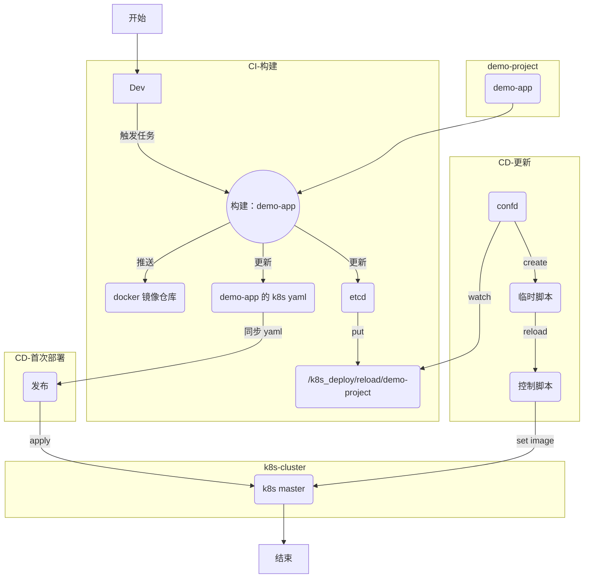

# CICD-如何部署到k8s集群中
2018/1/5


### 如何部署到k8s集群中
  - CI
    - 结合 jenkins pipeline
    - 输出
      - docker image
      - k8s yaml
      - update etcd key
  - CD
    - 服务初次部署
      - 同步 k8s yaml
    - 服务的更新
      - confd watch etcd key
      - create k8s deploy script
      - run script




##### 服务初次部署
- 采用构建时生成的 yaml 配置
```bash
### 通过 apply来部署服务时，可以指定 yaml 所在目录，方便同时批量执行多个 yaml
[root@tvm-00 k8s-deploy]# kubectl apply -f ns-dev/demo-project/ --record
```

##### 服务的更新
- 前提假设
  - 熟悉 etcd
  - 熟悉 confd
- 在 CI 环节中，构建服务时，同步更新服务的记录到 etcd 中
- 通过 confd 来 watch 对应的 key 自动生成一个配置文件，继而用来触发该服务的更新操作
```bash
### 创建一个 etcd 实例
nohup etcd --name etcd_dev --data-dir /data/jenkins_node_home/workspace/cicd/etcd_dev \
  --listen-client-urls 'http://0.0.0.0:2379' \
  --advertise-client-urls 'http://0.0.0.0:2379' \
  >/var/log/etcd_dev.log 2>&1 &

### 测试
ETCDCTL_API=3 /usr/local/bin/etcdctl --endpoints "http://10.10.9.111:2379" put foo bar
ETCDCTL_API=3 /usr/local/bin/etcdctl --endpoints "http://10.10.9.111:2379" get foo


### 计划写入数据
ETCDCTL_API=3 /usr/local/bin/etcdctl --endpoints "http://10.10.9.111:2379" put '/k8s-deploy/reload/demo-project' '{"k8sNamespace":"ns-dev","appParent":"demo-project","appName":"s1","imageLatest":"registry.cn-hangzhou.aliyuncs.com/ns-demo-project/s1:e1234a5"}'


### 配置使用 confd
[root@tvm-00 confd]# pwd
/etc/confd
[root@tvm-00 confd]# ls
conf.d  templates

##### 配置文件
[root@tvm-00 confd]# cat conf.d/reload.toml
[template]
prefix = "/k8s-deploy/reload"
src = "reload.tmpl"
dest = "/data/server/k8s-deploy/reload/auto.create.cmd"
owner = "root"
mode = "0644"
keys = [
  "/demo-project",
]
reload_cmd = "cd /data/server/k8s-deploy && /bin/bash bin/confd_reload_cmd.sh reload/auto.create.cmd"

##### 模版文件
[root@tvm-00 confd]# cat templates/reload.tmpl
# Generated by confd {{datetime}}
{{$data := json (getv "/demo-project")}}
kubectl -n {{$data.k8sNamespace}} set image deployments/{{$data.appParent}}-{{$data.appName}} {{$data.appName}}={{$data.imageLatest}}

##### 控制脚本
[root@tvm-00 confd]# cat /data/server/k8s-deploy/bin/confd_reload_cmd.sh
#!bin/bash
#
#2018/1/22

f_log="/data/server/k8s-deploy/logs/$(date +%F).log"

do_reload() {
  echo -e "[+] -----------------> $(date +%F_%T) \t op=reload"
  echo -e "[-] -----------------> commands in file: $1"
  cat $1  |grep -v '^$'
  echo -e "[-] -----------------> run: $1"
  sh -x $1
  echo -e "[-] -----------------> code: $?"
}

do_reload $1 >>${f_log} 2>&1 &


### 单次运行，来测试配置是否符合预期
[root@tvm-00 confd]# /usr/local/bin/confd -log-level debug -onetime -backend etcdv3 -node http://10.10.9.111:2379

### 将 etcd 放到后台运行，使用 watch 参数来持续更新
[root@tvm-00 confd]# /usr/local/bin/confd -log-level info -backend etcdv3 -node http://10.10.9.111:2379 -watch >>/data/server/k8s-deploy/logs/.confd.log 2>&1 &
```
