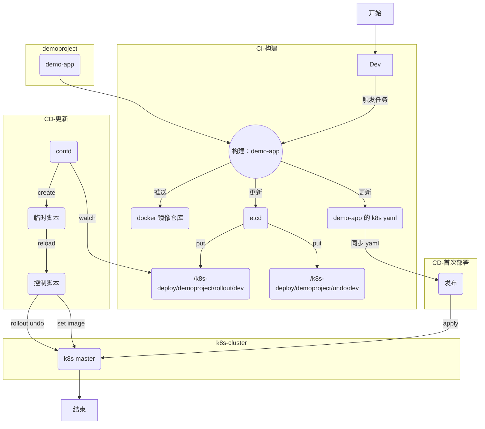

# CICD-如何部署到k8s集群中
2018/4/20


### 如何部署到k8s集群中
---
- CI
  - 结合 jenkins pipeline
  - 输出
    - docker image
    - k8s yaml
    - update etcd key
- CD
  - 服务初次部署
    - 同步 k8s yaml
  - 服务的更新
    - `confd` watch `etcd` key
    - create k8s deploy script
    - run script

流程图
---



### 服务如何部署上线-第一次
采用构建时生成的 yaml 配置来部署服务

> 通过 `kubectl apply` 来部署服务时，可以指定 `yaml` 文件所在目录，方便批量 `apply` 同目录下的多个 `yaml` 文件（用途：例如同时上线指定 app 目录下的多个微服务模块）

```bash
[root@tvm-00 k8s-deploy]# kubectl apply -f ns-demo-dev/demoproject/ --record

```

### 服务如何部署上线-CI/CD
> 前提：熟悉 `etcd` + `confd`

在 CI/CD 环节中，主要涉及下述操作：
- build             构建(golang->docker)
- rollout           上线(etcd->k8s)
- undo              回滚(etcd->k8s)

原理：通过 `confd` 来 `watch` `etcd` 对应的 `key` 并在检测到有更新时，自动生成一个临时脚本（内容内容皆可，本文中实际上是 kubectl 相关指令），最后通过 reload_cmd 来执行上述脚本，从而触发相关操作。

*创建一个 etcd 实例*
```bash
nohup etcd --name etcd_dev --data-dir /data/jenkins_node_home/workspace/cicd/etcd_dev \
  --listen-client-urls 'http://0.0.0.0:2379' \
  --advertise-client-urls 'http://0.0.0.0:2379' \
  >/var/log/etcd_dev.log 2>&1 &

### 测试
ETCDCTL_API=3 /usr/local/bin/etcdctl --endpoints "http://10.250.3.100:2379" put foo bar
ETCDCTL_API=3 /usr/local/bin/etcdctl --endpoints "http://10.250.3.100:2379" get foo

### 计划写入数据
ETCDCTL_API=3 /usr/local/bin/etcdctl --endpoints "http://10.250.3.100:2379" put '/k8s-deploy/demoproject//rollout/dev' '{"k8sNamespace":"ns-demo-dev","appParent":"demoproject","appName":"s1","imageLatest":"registry.cn-hangzhou.aliyuncs.com/ns-my-company/s1:e1234a5"}'

```

*配置 `confd` 服务*
```bash
[root@tvm-00 confd]# pwd
/etc/confd
[root@tvm-00 confd]# tree .
.
├── conf.d
│   ├── demoproject-rollout.toml
│   └── demoproject-undo.toml
└── templates
    ├── demoproject-rollout.tmpl
    └── demoproject-undo.tmpl

2 directories, 4 files
```

*配置文件 - rollout*
```bash
[root@tvm-00 confd]# cat conf.d/demoproject-rollout.toml
[template]
prefix = "/k8s-deploy/demoproject/rollout"
src = "demoproject-rollout.tmpl"
dest = "/data/server/k8s-deploy/temp.cmd/demoproject-rollout"
owner = "root"
mode = "0644"
keys = [
  "/dev",
]
reload_cmd = "cd /data/server/k8s-deploy && /bin/bash bin/confd_reload_cmd.sh temp.cmd/demoproject-rollout"
```

*配置文件 - undo*
```bash
[root@tvm-00 confd]# cat conf.d/demoproject-undo.toml
[template]
prefix = "/k8s-deploy/demoproject/undo"
src = "demoproject-undo.tmpl"
dest = "/data/server/k8s-deploy/temp.cmd/demoproject-undo"
owner = "root"
mode = "0644"
keys = [
  "/dev",
]
reload_cmd = "cd /data/server/k8s-deploy && /bin/bash bin/confd_reload_cmd.sh temp.cmd/demoproject-undo"
```

*和配置文件对应的模版 - rollout*
```bash
[root@tvm-00 confd]# cat templates/demoproject-rollout.tmpl
# Generated by confd {{datetime}}
### key=/k8s-deploy/demoproject/rollout/dev
{{if exists "/dev"}}
{{$data := json (getv "/dev")}}
kubectl -n {{$data.k8sNamespace}} set image deployments/{{$data.appParent}}-{{$data.appName}} {{$data.appName}}={{$data.imageLatest}}
{{end}}
```

*和配置文件对应的模版 - undo*
```bash
[root@tvm-00 confd]# cat templates/demoproject-undo.tmpl
# Generated by confd {{datetime}}
### key=/k8s-deploy/demoproject/undo/dev
{{if exists "/dev"}}
{{$data := json (getv "/dev")}}
kubectl -n {{$data.k8sNamespace}} rollout history deployments/{{$data.appParent}}-{{$data.appName}}
kubectl -n {{$data.k8sNamespace}} rollout undo deployments/{{$data.appParent}}-{{$data.appName}}
kubectl -n {{$data.k8sNamespace}} rollout history deployments/{{$data.appParent}}-{{$data.appName}}
{{end}}
```


##### `confd` *reload_cmd* 指令对应的控制脚本
```bash
[root@tvm-00 confd]# cat /data/server/k8s-deploy/bin/confd_reload_cmd.sh
#!bin/bash
#
# 2018/4/20

s_dt=$(date +%Y%m%d_%H%M%S)
f_dest="$1"
f_log_dir="/data/server/k8s-deploy/logs/$(echo ${f_dest} |awk -F'/' '{print $2}')"
test -d "${f_log_dir}" || mkdir -p "${f_log_dir}"
f_log="${f_log_dir}/${s_dt}.log"

do_confd_reload_cmd() {
  echo -e "[+] ---------------------------------> [${s_dt}] op=do_confd_reload_cmd"
  echo -e "[-] ___> [CAT_CMD] ${f_dest}"
  cat ${f_dest}  |grep -v '^$'
  echo -e "[-] ___> [RUN_CMD] ${f_dest}"
  sh -x ${f_dest}
  echo -e "[-] ___> [EXIT_CODE] $?"
}

### cleanup
find "${f_log_dir}" -type f -name '*.log' -mmin +10 -delete

do_confd_reload_cmd ${f_dest} >>${f_log} 2>&1 &

```

### 测试：单次运行
---
使用 `-onetime` 指令在前台运行 `confd` 服务
```bash
[root@tvm-00 confd]# /usr/local/bin/confd -log-level debug -onetime -backend etcdv3 -node http://10.250.3.100:2379

```

### 后台运行 `confd` 服务
---
使用 `-watch` 指令来监听 `etcd` 的 key 是否更新

提供一个简易脚本来操作：
```bash
[root@tvm-00 confd]# cat /data/server/k8s-deploy/bin/confd_ctl.sh
#!/bin/bash
#
# 2018/4/20

do_cleanup_undo() {
  for key in $(grep 'k8s-deploy' /data/server/k8s-deploy/temp.cmd/undo.* |awk -F'=' '{print $2}'); do
    echo "cleanup etcd key: ${key}"
    ETCDCTL_API=3 /usr/local/bin/etcdctl --endpoints "http://10.250.3.100:2379" del ${key}
  done
  rm -f /data/server/k8s-deploy/temp.cmd/undo.*
}

do_start() {
  do_cleanup_undo
  /usr/local/bin/confd -log-level debug -backend etcdv3 -node http://10.250.3.100:2379 -watch >>/data/server/k8s-deploy/logs/.confd.log 2>&1 &
}

do_stop() {
  kill $(ps -ef |grep '/usr/local/bin/confd -log-level debug -backend etcdv3 -node http://10.250.3.100:2379 -watch' |grep -v grep |awk '{print $2}')
}

do_status() {
  ps -ef |grep '/usr/local/bin/confd -log-level debug -backend etcdv3 -node http://10.250.3.100:2379 -watch' |grep -v grep
}

case $1 in
  start|stop|status)
    do_$1
    ;;
  restart)
    do_stop
    sleep 1
    do_start
    ;;
  *)
    echo $"$0 [start|stop|restart|status]"
    ;;
esac
```
