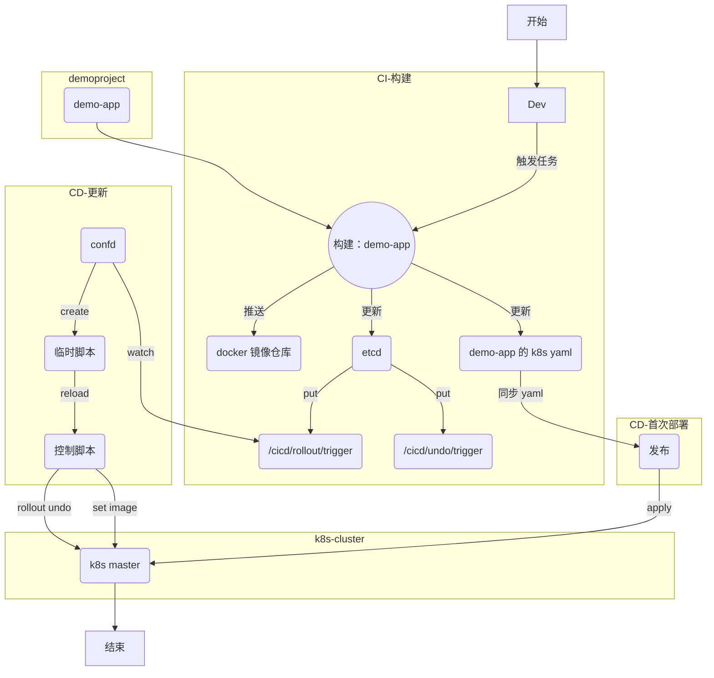

# CICD-使用confd监控etcd的变化来触发reload指令
2018/7/7


### 如何部署到k8s集群中
---
- CI
  - 结合 jenkins pipeline
  - 输出
    - docker image
    - k8s yaml
    - update etcd key
- CD
  - 服务初次部署
    - 同步 k8s yaml
  - 服务的更新
    - `confd` watch `etcd` key
    - create k8s deploy script
    - run script

流程图
---



### 服务如何部署上线-第一次
采用构建时生成的 yaml 配置来部署服务

> 通过 `kubectl apply` 来部署服务时，可以指定 `yaml` 文件所在目录，方便批量 `apply` 同目录下的多个 `yaml` 文件（用途：例如同时上线指定 app 目录下的多个微服务模块）

```bash
[root@tvm-00 k8s-deploy]# kubectl apply -f ns-demo1-dev/demoproject/ --record

```

### 服务如何部署上线-CI/CD
> 前提：熟悉 `etcd` + `confd`

在 CI/CD 环节中，主要涉及下述操作：
- build             构建(golang->docker)
- rollout           上线(etcd->k8s)
- undo              回滚(etcd->k8s)

原理：通过 `confd` 来 `watch` `etcd` 对应的 `key` 并在检测到有更新时，自动生成一个临时脚本（内容内容皆可，本文中实际上是 kubectl 相关指令），最后通过 reload_cmd 来执行上述脚本，从而触发相关操作。

*创建一个 etcd 实例*
```bash
nohup etcd --name etcd_dev --data-dir /data/server/k8s-deploy/etcd_dev \
  --listen-client-urls 'http://0.0.0.0:2379' \
  --advertise-client-urls 'http://0.0.0.0:2379' \
  >/var/log/etcd_dev.log 2>&1 &

### 测试
ETCDCTL_API=3 /usr/local/bin/etcdctl --endpoints "http://10.250.3.100:2379" put foo bar
ETCDCTL_API=3 /usr/local/bin/etcdctl --endpoints "http://10.250.3.100:2379" get foo

### 计划写入数据
ETCDCTL_API=3 /usr/local/bin/etcdctl --endpoints "http://10.250.3.100:2379" put '/cicd/undo/trigger'  '{"action":"undo","k8sNamespace":"ns-demo1-dev","appName":"demo1","svcName":"gateway","imageTag":"v3"}'

ETCDCTL_API=3 /usr/local/bin/etcdctl --endpoints "http://10.250.3.100:2379" put '/cicd/rollout/trigger'  '{"action":"deploy","k8sNamespace":"ns-demo1-dev","appName":"demo1","svcName":"gateway","imageTag":"v1"}'


### 清理数据
ETCDCTL_API=3 /usr/local/bin/etcdctl --endpoints "http://10.250.3.100:2379" get --prefix ''

ETCDCTL_API=3 /usr/local/bin/etcdctl --endpoints "http://10.250.3.100:2379" del --prefix ''


```

*配置 `confd` 服务*
```bash
[root@tvm-00 confd]# pwd
/etc/confd
[root@tvm-00 confd]# tree .
.
├── conf.d
│   ├── rollout.toml
│   └── undo.toml
└── templates
    ├── rollout.tmpl
    └── undo.tmpl

2 directories, 4 files
```

*配置文件 - rollout*
```bash
[root@tvm-00 confd]# cat conf.d/rollout.toml
[template]
prefix = "/cicd/rollout"
src = "rollout.tmpl"
dest = "/data/server/k8s-deploy/reload/rollout.cmd"
owner = "root"
mode = "0644"
keys = [
  "/trigger",
]
reload_cmd = "cd /data/server/k8s-deploy && /bin/bash bin/confd-reload-cmd.sh reload/rollout.cmd"

```

*配置文件 - undo*
```bash
[root@tvm-00 confd]# cat conf.d/undo.toml
[template]
prefix = "/cicd/undo"
src = "undo.tmpl"
dest = "/data/server/k8s-deploy/reload/undo.cmd"
owner = "root"
mode = "0644"
keys = [
  "/trigger",
]
reload_cmd = "cd /data/server/k8s-deploy && /bin/bash bin/confd-reload-cmd.sh reload/undo.cmd"

```

*和配置文件对应的模版 - rollout*
```bash
[root@tvm-00 confd]# cat templates/rollout.tmpl
### key=/cicd/rollout/trigger
{{if exists "/trigger"}}
{{$data := json (getv "/trigger")}}
### ------ input exp:
# action: {{$data.action}}
# k8sNamespace: {{$data.k8sNamespace}}
# appName: {{$data.appName}}
# svcName: {{$data.svcName}}
# imageTag: {{$data.imageTag}}
### ------ output exp: k8s cmd
# kubectl -n {{$data.k8sNamespace}} set image deployments/{{$data.appName}}-{{$data.svcName}} {{$data.svcName}}=registry.cn-hangzhou.aliyuncs.com/ns-demo/{{$data.appName}}-{{$data.svcName}}:{{$data.imageTag}}

{{end}}

```

*和配置文件对应的模版 - undo*
```bash
[root@tvm-00 confd]# cat templates/demoproject-undo.tmpl
### key=/cicd/undo/trigger
{{if exists "/trigger"}}
{{$data := json (getv "/trigger")}}
### ------ input exp:
# action: {{$data.action}}
# k8sNamespace: {{$data.k8sNamespace}}
# appName: {{$data.appName}}
# svcName: {{$data.svcName}}
# imageTag: {{$data.imageTag}}
### ------ output exp: k8s cmd
# kubectl -n {{$data.k8sNamespace}} rollout history deployments/{{$data.appName}}-{{$data.svcName}}
# kubectl -n {{$data.k8sNamespace}} rollout undo deployments/{{$data.appName}}-{{$data.svcName}}
# kubectl -n {{$data.k8sNamespace}} rollout history deployments/{{$data.appName}}-{{$data.svcName}}

{{end}}

```


##### `confd` *reload_cmd* 指令对应的控制脚本
```bash
[root@tvm-00 confd]# cat /data/server/k8s-deploy/bin/confd-reload-cmd.sh
#!bin/bash
#
# 2018/7/7

s_dt=$(date +%Y%m%d_%H%M%S)
f_dest="$1"
f_log_dir="/data/server/k8s-deploy/logs/$(echo ${f_dest} |awk -F'/' '{print $2}')"
test -d "${f_log_dir}" || mkdir -p "${f_log_dir}"
f_log="${f_log_dir}/${s_dt}.log"

do_confd_reload_cmd() {
  echo
  echo -e "[+] ---------------------------------> [${s_dt}] op=do_confd_reload_cmd"
  echo -e "[-] ___> [CAT_CMD] ${f_dest}"
  echo '##################################################'
  cat ${f_dest}  |grep -v '^$'
  echo '##################################################'
  echo -e "[-] ___> [RUN_CMD] ${f_dest}"
  echo
  sh ${f_dest}
  echo
  echo -e "[-] ___> [EXIT_CODE] $?"
  echo
}

### cleanup
find "${f_log_dir}" -type f -name '*.log' -mmin +10 -delete

do_confd_reload_cmd ${f_dest} >>${f_log} 2>&1 &

```

### 测试：单次运行
---
使用 `-onetime` 指令在前台运行 `confd` 服务
```bash
[root@tvm-00 confd]# /usr/local/bin/confd -log-level debug -onetime -backend etcdv3 -node http://10.250.3.100:2379

```

### 后台运行 `confd` 服务
---
使用 `-watch` 指令来监听 `etcd` 的 key 是否更新

提供一个控制脚本：
```bash
[root@tvm-00 confd]# cat /data/server/k8s-deploy/bin/k8s-confd-ctl.sh
#!/bin/bash
#
# 2018/7/7

default_test_repeat_times=10
default_test_target_action="rollout"
default_etcd_endpoints="http://10.250.3.100:2379"
default_etcd_prefix="/cicd"
d_root="/data/server/k8s-deploy"
f_log="${d_root}/logs/.confd.log"

do_test_reload_diff() {
  local count="$1"
  local target_key_field="$2"
  local target_key="${default_etcd_prefix}/${target_key_field}/trigger"
  cd ${d_root}
  echo >logs/.confd.log
  rm -fv logs/${target_key_field}.cmd/*.log
  sleep 1s
  for i in `seq 1 ${count}`; do
    echo -n "第 [$i] 次 PUT 操作: "
    json_data="
{
  \"action\":\"deploy\",
  \"k8sNamespace\":\"ns-demo1-dev\",
  \"appName\":\"demo1\",
  \"svcName\":\"gateway\",
  \"imageTag\":\"v1-diff-$i\"
}
"
    ETCDCTL_API=3 /usr/local/bin/etcdctl --endpoints "${default_etcd_endpoints}" put "${target_key}" "${json_data}"
  done
  sleep 1s
  echo "+ [验证] 测试重复次数预期为: ${count} 次"
  echo -n "-- [DEBUG Key updated]: "
  cat logs/.confd.log |grep -c 'DEBUG Key updated'
  echo -n "-- [DEBUG in sync]: "
  cat logs/.confd.log |grep -c 'in sync'
  echo -n "-- [DEBUG out of sync]: "
  cat logs/.confd.log |grep -c 'out of sync'
  echo -n "-- [DEBUG Running]: "
  cat logs/.confd.log |grep -c 'DEBUG Running'
  echo -n "-- [set image]: "
  cat logs/${target_key_field}.cmd/*.log |grep -c 'set image'

}

do_test_reload_not_change() {
  local count="$1"
  local target_key_field="$2"
  local target_key="${default_etcd_prefix}/${target_action}/trigger"
  cd ${d_root}
  echo >logs/.confd.log
  rm -fv logs/${target_key_field}.cmd/*.log
  sleep 1s
  for i in `seq 1 ${count}`; do
    echo -n "第 [$i] 次 PUT 操作: "
    json_data="
{
  \"action\":\"undo\",
  \"k8sNamespace\":\"ns-demo1-dev\",
  \"appName\":\"demo1\",
  \"svcName\":\"gateway\",
  \"imageTag\":\"v2-the-same\"
}
"
    ETCDCTL_API=3 /usr/local/bin/etcdctl --endpoints "${default_etcd_endpoints}" put "${target_key}" "${json_data}"
  done
  sleep 1s
  echo "+ [验证] 测试重复次数预期为: ${count} 次"
  echo -n "-- [DEBUG Key updated]: "
  cat logs/.confd.log |grep -c 'DEBUG Key updated'
  echo -n "-- [DEBUG in sync]: "
  cat logs/.confd.log |grep -c 'in sync'
  echo -n "-- [DEBUG out of sync]: "
  cat logs/.confd.log |grep -c 'out of sync'
  echo -n "-- [DEBUG Running]: "
  cat logs/.confd.log |grep -c 'DEBUG Running'
  echo -n "-- [set image]: "
  cat logs/${target_key_field}.cmd/*.log |grep -c 'set image'

}

do_cleanup_undo() {
  local target_key="${default_etcd_prefix}/undo"
  ETCDCTL_API=3 /usr/local/bin/etcdctl --endpoints "${default_etcd_endpoints}" del "${target_key}"
  rm -fv "${d_root}/reload/undo.cmd"
}

do_start() {
  do_cleanup_undo
  /usr/local/bin/confd -log-level debug -backend etcdv3 -node "${default_etcd_endpoints}" -watch >>${f_log} 2>&1 &
}

do_stop() {
  kill $(ps -ef |grep '/usr/local/bin/confd -log-level debug -backend etcdv3' |grep -v grep |awk '{print $2}')
}

do_status() {
  ps -ef |grep '/usr/local/bin/confd -log-level debug -backend etcdv3' |grep -v grep
  echo '++++++++++++++++++++++++++++++++++++++++++++++++++++++++++++'
  tail ${f_log}
  echo '++++++++++++++++++++++++++++++++++++++++++++++++++++++++++++'
}

case $1 in
  start|stop)
    do_$1
    do_status
    ;;
  status)
    do_$1
    ;;
  restart)
    do_stop
    sleep 1
    do_start
    sleep 1
    do_status
    ;;
  test)
    [ -z $2 ] && repeat_times="${default_test_repeat_times}" || repeat_times="$2"
    [ -z $3 ] && target_action="${default_test_target_action}" || target_action="$3"
    echo '_________________________________test: diff tag'
    do_test_reload_diff ${repeat_times} ${target_action}
    echo '_________________________________test: same tag'
    do_test_reload_not_change ${repeat_times} ${target_action}
    ;;
  *)
    cat <<"_EOF"

USAGE:

    $0 [start|stop|restart|status]"

    $0 [test] [repeat_times] [target_action]"

_EOF
    ;;
esac

```


### FAQ
1、 在配置 confd 时，可以配置多个 `toml` 文件，但请注意每个文件中的 `prefix` 要是唯一无二的，否则在后续 watch 时，将因为有多个配置使用同一个 prefix 而导致更新不及时的异常。

可以观察到下述现象：
```
2018-04-20T11:57:31+08:00 tvm-00 /usr/local/bin/confd[26430]: DEBUG Key updated /k8s-deploy/demoproject/rollout
2018-04-20T11:57:48+08:00 tvm-00 /usr/local/bin/confd[26430]: DEBUG Key updated /k8s-deploy/demoproject/rollout
2018-04-20T11:58:26+08:00 tvm-00 /usr/local/bin/confd[26430]: DEBUG Key updated /k8s-deploy/demoproject/rollout
2018-04-20T11:58:29+08:00 tvm-00 /usr/local/bin/confd[26430]: DEBUG Key updated /k8s-deploy/demoproject/rollout
2018-04-20T11:58:29+08:00 tvm-00 /usr/local/bin/confd[26430]: DEBUG Retrieving keys from store
2018-04-20T11:58:29+08:00 tvm-00 /usr/local/bin/confd[26430]: DEBUG Key prefix set to /
2018-04-20T11:58:29+08:00 tvm-00 /usr/local/bin/confd[26430]: DEBUG Got the following map from store: map[/k8s-deploy/demoproject/rollout:{"appName":"demoproject","errMsg":"t1"}]
2018-04-20T11:58:29+08:00 tvm-00 /usr/local/bin/confd[26430]: DEBUG Using source template /etc/confd/templates/demoproject-rollout.tmpl
2018-04-20T11:58:29+08:00 tvm-00 /usr/local/bin/confd[26430]: DEBUG Compiling source template /etc/confd/templates/demoproject-rollout.tmpl
2018-04-20T11:58:29+08:00 tvm-00 /usr/local/bin/confd[26430]: DEBUG Comparing candidate config to /data/server/k8s-deploy/temp.cmd/demoproject-rollout
2018-04-20T11:58:29+08:00 tvm-00 /usr/local/bin/confd[26430]: INFO /data/server/k8s-deploy/temp.cmd/demoproject-rollout has md5sum 38616c9f5fd6fac4bc926488b5de88e7 should be f7cd944bd7932715ab74c84277769602
2018-04-20T11:58:29+08:00 tvm-00 /usr/local/bin/confd[26430]: INFO Target config /data/server/k8s-deploy/temp.cmd/demoproject-rollout out of sync
2018-04-20T11:58:29+08:00 tvm-00 /usr/local/bin/confd[26430]: DEBUG Overwriting target config /data/server/k8s-deploy/temp.cmd/demoproject-rollout
2018-04-20T11:58:29+08:00 tvm-00 /usr/local/bin/confd[26430]: DEBUG Running cd /data/server/k8s-deploy && /bin/bash bin/confd_reload_cmd.sh temp.cmd/demoproject-rollout
2018-04-20T11:58:29+08:00 tvm-00 /usr/local/bin/confd[26430]: DEBUG ""
2018-04-20T11:58:29+08:00 tvm-00 /usr/local/bin/confd[26430]: INFO Target config /data/server/k8s-deploy/temp.cmd/demoproject-rollout has been updated
```

上述日志对应的2个配置文件大致是：

- demoproject-rollout.toml
```
prefix = "/key1"
keys = [
  "/k8s-deploy/demoproject/rollout"
]
```

- demoproject-undo.toml
```
prefix = "/key1"
keys = [
  "/k8s-deploy/demoproject/undo"
]
```

执行的操作是：
```bash
ETCDCTL_API=3 /usr/local/bin/etcdctl --endpoints "http://10.250.3.100:2379" get '/k8s-deploy/demoproject/rollout'
##### 连续执行 4 次
ETCDCTL_API=3 /usr/local/bin/etcdctl --endpoints "http://10.250.3.100:2379" put '/k8s-deploy/demoproject/rollout' '{"appName":"demoproject","errMsg":"t1"}'
```

上述操作表明，连续更新了 4 次 key 但只有第 4 次才生效，实际上预期的结果是每一次都会生效。


即使不指定 `prefix` 也是会有问题，因为 `prefix` 默认值是 `/`

上述 `confd` 控制脚本中，提供了一个 `test` 指令来覆盖这类场景的有效性。
```bash
[root@tvm-00 k8s-deploy]# sh bin/k8s-confd-ctl.sh test 10 rollout
_________________________________test: diff tag
removed ‘logs/rollout.cmd/20180707_174355.log’
第 [1] 次 PUT 操作: OK
第 [2] 次 PUT 操作: OK
第 [3] 次 PUT 操作: OK
第 [4] 次 PUT 操作: OK
第 [5] 次 PUT 操作: OK
第 [6] 次 PUT 操作: OK
第 [7] 次 PUT 操作: OK
第 [8] 次 PUT 操作: OK
第 [9] 次 PUT 操作: OK
第 [10] 次 PUT 操作: OK
+ [验证] 测试重复次数预期为: 10 次
-- [DEBUG Key updated]: 10
-- [DEBUG in sync]: 0
-- [DEBUG out of sync]: 10
-- [DEBUG Running]: 10
-- [set image]: 10
_________________________________test: same tag
removed ‘logs/rollout.cmd/20180707_175437.log’
第 [1] 次 PUT 操作: OK
第 [2] 次 PUT 操作: OK
第 [3] 次 PUT 操作: OK
第 [4] 次 PUT 操作: OK
第 [5] 次 PUT 操作: OK
第 [6] 次 PUT 操作: OK
第 [7] 次 PUT 操作: OK
第 [8] 次 PUT 操作: OK
第 [9] 次 PUT 操作: OK
第 [10] 次 PUT 操作: OK
+ [验证] 测试重复次数预期为: 10 次
-- [DEBUG Key updated]: 10
-- [DEBUG in sync]: 9
-- [DEBUG out of sync]: 1
-- [DEBUG Running]: 1
-- [set image]: 1

```
